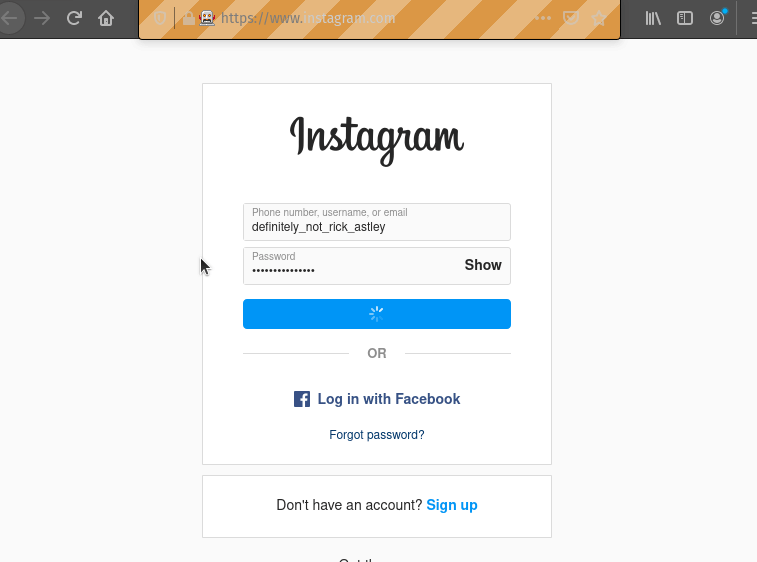

# Dev-log[0]: First Steps and Environment Setup
[@4/15/2021]()

Ok so technically this isn't the first day I worked on the project but it's the first day that I got actual progress on it. 

## Progress done before this log

### Repo Setup + Research

Before today all I had really done was setup the repository and do some research on existing tutorials to find out what people have done on instagram-bots. There seems to be promising work done in automating gaining a larger following through the use of "liking" "following" and other shallow means of interaction. 

The browser automation industry seems to point in the direction of using Selenium and Python. The current plan is to use Python to drive all of the code. Python webscraper to find inconspicuous looking media, Python movie library to stitch the Rick-roll in, and finally Python + Selenium to upload the material. 

### Environment Setup

However, the environment installation and set-up was a bit more confusing than it ought to have been as my daily driver runs wsl. Since I've been itching to use Linux more, I decided to wait until I had a solid Linux installation before continuing

### Copyright + Legal Issues

On a different note, copyright is certainly a concern so there's a good chance much that there will be some form of problem with uploading this material. However, this will be a great exercise for myself as a fan of the Rick Roll.

As a test, I made a sample video of what I would eventually be automating to my personal account. The test video consisted of a "MCU+DCEU" poster to the Avenger's theme song. I was immediately greeted by 3 copyright notices from Sony Entertainment. Even after changing the theme song the copyrights remained but since this was for April Fool's I didn't bother trying to change the poster to see if that was the problem. It appears to be that the platform may cause some difficulties in the realm of copyrights.

Worse case-scenario I'll just use it to send private videos to people.

## Today's Progress

After setting up my PopOs! installation the environment set-up was very smooth. Current progress is as follows:

This is as far as the tutorial goes on setup so from here it gets a bit more wild. I don't plan on building up a user base until I get the automation to work. 

However, once I started thinking about the next steps, I realized that I couldn't actually post to Instagram directly from a laptop.

One solution is to create and run the bot on Facebook and link the accounts to get to a wider audience. 

I will also probably need to make a dedicated email account for the two services to increase separation between my personal life and this dangerous life of Rick-Rolling. At least nothing that connects the bot account with my personal life anyway.